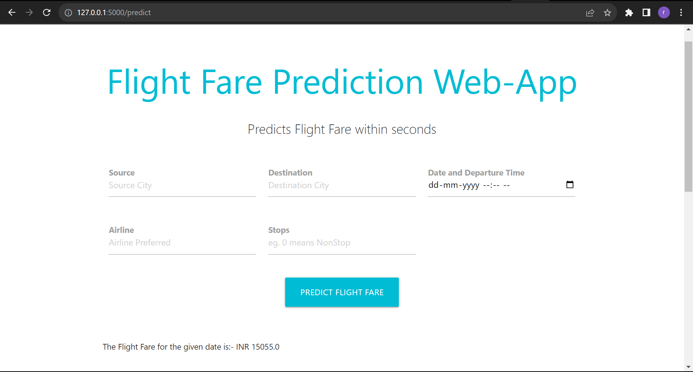

# Flight Fare Predictor Web App


The Flight Fare Predictor Web App is a Flask-based web application that allows users to predict flight fares based on various input parameters such as source city, destination city, date and departure time, airline, and number of stops. The app uses a machine learning model to make predictions and provides the estimated flight fare in Indian Rupees (INR).

## Installation

To run the application locally, follow these steps:

1. Clone the repository to your local machine:

   ```
   git clone [https://github.com/](https://github.com/Rparab0/FLight-prediction-flask-app.git)
   cd flight-fare-predictor
   ```

2. Create a virtual environment and activate it:

   ```
   python -m venv venv
   source venv/bin/activate   # For Windows: venv\Scripts\activate
   ```

3. Install the required packages:

   ```
   pip install -r requirements.txt
   ```

4. Download the `model.pkl` file from the provided link:

   [Download model.pkl](https://drive.google.com/file/d/15ssm73OTEoXC6ZDg20XUIVqyzKQ1Pizb/view?usp=drive_link)

5. Place the downloaded `model.pkl` file in the root directory of the project.

6. Run the Flask application:

   ```
   python app.py
   ```

7. Access the web app in your browser at `http://localhost:5000/`.

## Usage

1. On the web app's home page, enter the source city, destination city, date and departure time, preferred airline, and number of stops for your flight.

2. Click the "Predict Flight Fare" button to see the estimated flight fare.

   - If the flight has non-stop (0 stops), the estimated fare will be provided as-is.
   - If the flight has one or more stops, the estimated fare will be reduced by 2000 INR for each stop.

3. If the source and destination cities are the same, the app will display an error message asking you to try again with different cities.

## Technology Stack

- Python
- Flask
- NumPy
- pandas
- Pickle

## Screenshots




---
